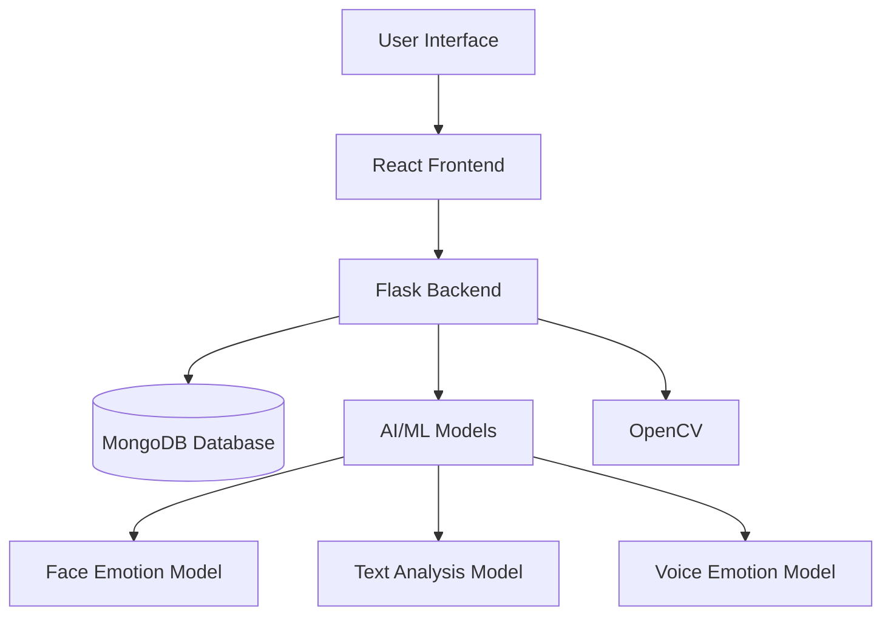

# EmotionSense: AI-powered Emotion Recognition and Analytics System

EmotionSense is an advanced AI-powered emotion detection application that analyzes facial expressions, voice tones, and text to identify human emotions. The application provides a comprehensive dashboard for users to interact with different emotion analysis modules, featuring real-time processing and visualization capabilities.

## Table of Contents
- [Features](#features)
- [Technologies Used](#technologies-used)
- [System Architecture](#system-architecture)
- [Installation](#installation)
  - [Prerequisites](#prerequisites)
  - [Setup Instructions](#setup-instructions)
- [Usage](#usage)
  - [Starting the Application](#starting-the-application)
  - [Using the Modules](#using-the-modules)
- [Project Structure](#project-structure)
- [Modules](#modules)
  - [Face Module](#face-module)
  - [Text Module](#text-module)
  - [Voice Module](#voice-module)
- [API Endpoints](#api-endpoints)
- [Database Schema](#database-schema)
- [Authentication](#authentication)
- [Machine Learning Models](#machine-learning-models)
- [Dataset Information](#dataset-information)
- [Troubleshooting](#troubleshooting)
- [Contributing](#contributing)
- [Author](#author)
- [License](#license)

## Features

- **Face Emotion Detection**: Real-time analysis of facial expressions through webcam input using computer vision techniques
- **Voice Emotion Analysis**: Detection of emotions from voice recordings through speech-to-text processing
- **Text Emotion Classification**: Identification of emotions and sentiment from written text using NLP techniques
- **User Authentication**: Secure login and registration system with JWT token authentication
- **Profile Management**: Personalized user dashboard with profile customization options
- **Real-time Visualization**: Interactive charts and graphs for emotion analysis results
- **Historical Data Tracking**: Recent analyses history for each module
- **Responsive Design**: Fully responsive UI that works on desktop and mobile devices
- **Cross-browser Compatibility**: Support for modern browsers including Chrome, Edge, and Firefox

## Technologies Used

### Frontend
- React v18.2.0
- Vite v4.3.9
- Tailwind CSS v3.3.2
- Framer Motion v10.12.16
- React Router DOM v7.8.2
- Chart.js v4.5.0
- Axios v1.4.0

### Backend
- Flask v2.0.1
- Python 3.8+
- TensorFlow v2.6.0
- OpenCV v4.5.3.56
- MongoDB with pymongo v4.1.1
- NLTK v3.8.1
- scikit-learn v1.3.0
- pandas v2.0.3

### Other Dependencies
- JWT for authentication (flask-jwt-extended v4.4.3)
- Bcrypt for password hashing v3.2.0

## Prerequisites

Before you begin, ensure you have the following installed:
- Node.js (v14 or higher)
- Python (v3.8 or higher)
- npm/yarn package manager
- MongoDB (local installation or MongoDB Atlas account)
- Git (for cloning the repository)
- Webcam (for face emotion detection)
- Microphone (for voice emotion analysis)
- pip (Python package manager)

## System Architecture



The system follows a client-server architecture where the React frontend communicates with the Flask backend through RESTful APIs. The backend handles all AI/ML processing, database operations, and business logic.

## Installation


### Setup Instructions

1. Clone the repository:
   ```bash
   git clone https://github.com/nileshkulkarniy/EmotionSense-AI-powered-Emotion-Recognition-and-Analytics-System.git
   cd EmotionSense
   ```

2. Install all dependencies using the installation script:
   ```bash
   ./install_all.bat
   ```
   
   Alternatively, you can install dependencies manually:
   
   a. Install frontend dependencies:
   ```bash
   npm install
   ```
   
   b. Install Python dependencies:
   ```bash
   pip install -r requirements.txt
   ```

3. Set up environment variables (if using MongoDB Atlas):
   Create a `.env` file in the root directory with:
   ```env
   MONGODB_URI=your_mongodb_connection_string
   JWT_SECRET_KEY=your_secret_key
   ```

4. Ensure MongoDB is running locally (if not using MongoDB Atlas):
   ```bash
   mongod
   ```

## Usage

### Starting the Application
Start the backend server:
```bash
python app.py
```
or
```bash
start_backend.bat
```

Start the frontend development server:
```bash
npm run dev
```
or
```bash
start_frontend.bat
```

1. Start the backend server:
   ```bash
   ./start_backend.bat
   ```
   
   This will:
   - Check if Python is installed
   - Install required packages if not already installed
   - Start the Flask server on port 5000
   
   The backend server will be available at `http://localhost:5000`

2. In a new terminal, start the frontend:
   ```bash
   ./start_frontend.bat
   ```
   
   This will:
   - Install frontend dependencies if needed
   - Start the React development server
   - The app will be available at `http://localhost:3006`
   
   Note: If port 3006 is in use, Vite will automatically select the next available port.

3. Access the application in your browser at `http://localhost:3006`

### Production

Build the frontend:
```bash
npm run build
```

Run the backend:
```bash
python app.py
```

### Using the Modules

#### Face Emotion Detection
1. Navigate to the Face Detection module
2. Click "Start Camera" to activate your webcam
3. Position yourself in front of the camera with good lighting
4. Make natural facial expressions for better detection
5. View real-time emotion analysis results in the charts

#### Text Emotion Analysis
1. Navigate to the Text Analysis module
2. Enter text in the input field
3. Click "Analyze Sentiment" to process
4. View sentiment results with confidence scores
5. Try different texts to see varying sentiments

#### Voice Emotion Analysis
1. Navigate to the Voice Analysis module
2. Click "Start Listening" to begin voice capture
3. Speak naturally - your words will appear in the text box
4. The system will automatically stop after 2 seconds of silence
5. Click "Analyze Emotion" to process your spoken words
6. View emotion analysis results with confidence scores

## Project Structure

```
EmotionSense/
├── src/                    # Frontend React components
│   ├── assets/             # Static assets
│   ├── components/         # Reusable UI components
│   │   ├── FaceDetection.jsx
│   │   ├── Footer.jsx
│   │   ├── Header.jsx
│   │   ├── Login.jsx
│   │   ├── Profile.jsx
│   │   └── Register.jsx
│   ├── modules/            # Feature modules (face, voice, text)
│   │   ├── Dashboard.jsx
│   │   ├── FaceModule.jsx
│   │   ├── TextModule.jsx
│   │   ├── VoiceModule.jsx
│   │   └── index.js
│   ├── App.jsx             # Main application component
│   ├── database.py         # Database operations
│   ├── index.css           # Global CSS styles
│   ├── main.jsx            # Entry point
│   └── text_analysis.py    # Text emotion analysis functions
├── app.py                  # Flask backend server
├── data/                   # Dataset files
│   ├── emotion_sentences.csv
│   └── voice_emotion_dataset.csv
├── models/                 # Pre-trained ML models
│   └── emotion_model.h5
├── templates/              # HTML templates
├── public/                 # Static assets
├── package.json            # Frontend dependencies
├── requirements.txt        # Python dependencies
├── vite.config.js          # Vite configuration
├── tailwind.config.cjs     # Tailwind CSS configuration
├── postcss.config.cjs      # PostCSS configuration
├── install_all.bat         # Installation script
├── start_backend.bat       # Backend startup script
└── start_frontend.bat      # Frontend startup script
```

## Modules

### Face Module
Detects emotions from facial expressions using computer vision techniques with OpenCV and TensorFlow. The module captures video from the webcam, detects faces using Haar Cascade classifiers, and analyzes facial expressions using a pre-trained deep learning model.

Features:
- Real-time face detection and emotion analysis
- Confidence scoring for each emotion
- Dominant emotion identification
- Interactive visualization charts
- Camera control (start/stop)

Supported Emotions:
- Angry
- Disgust
- Fear
- Happy
- Neutral
- Sad
- Surprise

### Text Module
Processes written text to classify emotional content and sentiment using natural language processing techniques. The module uses a combination of TF-IDF vectorization and logistic regression for sentiment analysis.

Features:
- Sentiment analysis (Positive, Negative, Neutral)
- Confidence scoring
- Interactive pie and bar charts
- Recent analyses history
- Text preprocessing (negation handling, stopword removal)

### Voice Module
Analyzes audio input by converting speech to text and then determining emotional tone and sentiment. The module uses the Web Speech API for speech recognition and applies text emotion analysis to the transcribed text.

Features:
- Speech-to-text conversion
- Emotion analysis from transcribed speech
- 30-second recording limit with automatic silence detection
- Confidence scoring for detected emotions
- Recent analyses history
- Emotion visualization charts

Supported Emotions:
- Happy
- Sad
- Angry
- Fear
- Disgust
- Surprise
- Neutral

## API Endpoints

### Authentication
- `POST /api/register` - Register a new user
- `POST /api/login` - Login user

### Face Emotion Detection
- `GET /video_feed` - Video streaming route for face detection
- `GET /start_camera` - Start the camera
- `GET /stop_camera` - Stop the camera
- `GET /emotion_data` - Get the latest emotion data

### Text Emotion Analysis
- `POST /analyze_text` - Analyze sentiment of text

### Voice Emotion Analysis
- `POST /analyze_voice_emotion` - Analyze emotion from voice-transcribed text

### Health Check
- `GET /health` - Health check endpoint

## Database Schema

### Users Collection
```javascript
{
  _id: ObjectId,
  username: String,
  email: String,
  password: String (hashed),
  created_at: Date,
  last_login: Date
}
```

## Authentication

The application uses JWT (JSON Web Tokens) for authentication:

1. User registers or logs in with email and password
2. Server validates credentials and generates a JWT token
3. Token is stored in localStorage on the client
4. Token is sent in the Authorization header for protected routes
5. Server validates the token before processing requests

## Machine Learning Models

### Face Emotion Detection Model
- **Type**: Convolutional Neural Network (CNN)
- **Framework**: TensorFlow/Keras
- **Input**: 48x48 grayscale face images
- **Output**: 7 emotion classes with confidence scores
- **Model File**: `models/emotion_model.h5`

### Text Sentiment Analysis Model
- **Type**: Logistic Regression with TF-IDF
- **Framework**: scikit-learn
- **Input**: Preprocessed text
- **Output**: 3 sentiment classes (positive, negative, neutral)
- **Features**: Unigrams and bigrams with stopword removal and negation handling

### Voice Emotion Analysis Model
- **Type**: Logistic Regression with TF-IDF
- **Framework**: scikit-learn
- **Input**: Transcribed speech text
- **Output**: 7 emotion classes with confidence scores
- **Features**: Unigrams and bigrams with stopword removal and negation handling

## Dataset Information

### Emotion Sentences Dataset
The application includes a custom-generated dataset of sentences for training text and voice emotion analysis models. The dataset covers 7 emotion categories:

1. Happy
2. Sad
3. Angry
4. Surprised
5. Neutral
6. Fear
7. Disgust

Each sentence follows grammatical patterns with varied subjects, verbs, adjectives, and extras to ensure diversity in the training data.

### Dataset Generation
The dataset is generated using the [generate_emotion_sentences.py](generate_emotion_sentences.py) script which creates varied emotional sentences using word pools for each emotion category.

### Dataset Files
- Primary Dataset: [data/emotion_sentences.csv](data/emotion_sentences.csv)
  - Format: CSV with "Emotion" and "Sentence" columns
- Voice Dataset: [data/voice_emotion_dataset.csv](data/voice_emotion_dataset.csv)
  - Format: CSV with "Emotion" and "Sentence" columns

## Troubleshooting

### Common Issues

1. **Camera not working**
   - Ensure you have a working webcam
   - Check camera permissions in your browser
   - Close other applications using the camera
   - Try different camera indices in the code

2. **Backend connection failed**
   - Ensure the Flask backend is running on port 5000
   - Check if any firewall is blocking the connection
   - Verify MongoDB is running or connection string is correct

3. **Speech recognition not working**
   - Speech recognition only works in Chrome and Edge browsers
   - Ensure your microphone is working and has proper permissions
   - Check browser settings for microphone access

4. **Model not loading**
   - Ensure the emotion model file exists in the models directory
   - Check file permissions for model files
   - Verify TensorFlow installation

5. **Dependencies not installing**
   - Ensure you have Python and Node.js installed
   - Check your internet connection
   - Try installing dependencies manually with pip and npm

### Debugging Steps

1. Check browser console for frontend errors
2. Check terminal output for backend errors
3. Verify all required services are running (MongoDB, Flask)
4. Ensure all dependencies are properly installed
5. Check network connections between frontend and backend

## Contributing

Contributions are welcome! Please follow these steps:

1. Fork the repository
2. Create a new branch for your feature or bug fix
3. Make your changes
4. Test thoroughly
5. Commit your changes with descriptive commit messages
6. Push to your fork
7. Create a pull request with a detailed description of your changes

### Development Guidelines

1. Follow the existing code style and structure
2. Write clear, commented code
3. Test your changes thoroughly
4. Update documentation as needed
5. Ensure backward compatibility

## Author

**Nilesh Kulkarni**
- Email: knilesh996@gmail.com
- GitHub: [Nilesh Kulkarni](https://github.com/nileshkulkarniy)
- Facebook: [Nilesh Kulkarni](https://www.facebook.com/nileshkulkarniyd)
- Instagram: [Nilesh Kulkarni](https://www.instagram.com/nileshkulkarniy)
- Twitter: [Nilesh Kulkarni](https://twitter.com/nileshkulkarniy)
- LinkedIn: [Nilesh Kulkarni](https://www.linkedin.com/in/nileshkulkarniy)

## License

This project is licensed under the MIT License - see the [LICENSE](LICENSE) file for details.

The MIT License is a permissive open-source license that allows for commercial use, modification, distribution, and patent use, with the only requirement being that the original copyright notice and license text be included in all copies or substantial portions of the software.

## Acknowledgments

- TensorFlow for the emotion detection model
- OpenCV for computer vision capabilities
- NLTK for natural language processing tools